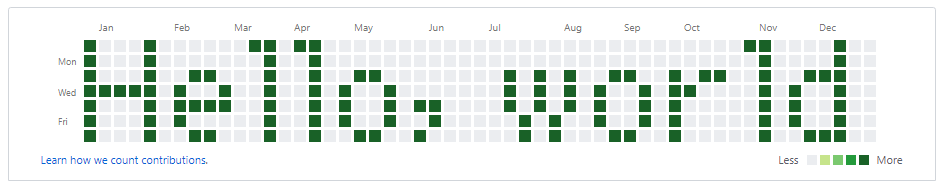

========
git-turf
========

The git-turf program outputs ASCII art to GitHub contribution graph.

Examples
========

::

    $ git-turf "Hello, world"
    #   #      ## ##                            ##    #
    #   #       #  #                             #    #
    #   #  ##   #  #  ##        # # #  ##  # ##  #  ###
    ##### #  #  #  # #  #       # # # #  # ##    # #  #
    #   # ####  #  # #  # ##    # # # #  # #     # #  #
    #   # #     #  # #  #  #     # #  #  # #     # #  #
    #   #  ##   #  #  ##  #      # #   ##  #     #  ###
    $ git push

Requirements
============

* Python 3.5 or higher

Installation
============

Install
-------

::

    $ git clone https://github.com/yoshi389111/git-turf.git
    $ cd git-turf
    $ pip3 install -e .

or

::

    $ pip3 install git+https://github.com/yoshi389111/git-turf.git

Uninstall
---------

::

    $ pip3 uninstall git-turf

Usage
=====

Usage:
------

::

    git-turf [-h]
    git-turf [-v]
    git-turf [-d DATE] [-t TIME] [-n] MESSAGE

Options:
--------

::

    -h,      --help       show this help message and exit
    -v,      --version    show program's version number and exit
    -d DATE, --date DATE  start date. format is YYYY-MM-DD
    -t TIME, --time TIME  commit time. format is HH:MM:SS
    -n,      --dry-run    display message only

FAQ
===

Q1: does running this app clear the existing calendar?
-----------------------------------------------------

Running this app will not clear your existing calendar.
It will just add to your existing calendar and increase the ASCII banner commit.

Q2: does the calendar have to be blank?
--------------------------------------

The calendar doesn't have to be blank, but it looks better if it is.

Q3: what happens if it's run twice with different input?
--------------------------------------------------------

Two ASCII banners are displayed one on top of the other.

Q4: does it depend on a certain version of GitHub environment?
--------------------------------------------------------------

It does not depend on a certain version.

Q5: what is the recommended way to do this?
-------------------------------------------

My recommendation is to create a new empty repository and commit and push to it.
Once you've had enough fun, you can just delete the repository.

Copyright and License
=====================

Program
-------

Copyright (C) 2019 SATO, Yoshiyuki

This software is released under the MIT License.
https://opensource.org/licenses/mit-license.php

Fonts
-----

The bitmap is created based on misaki_gothic.bdf font and k6x8.bdf font.

misaki_gothic.bdf
^^^^^^^^^^^^^^^^^

* Copyright(C) 2000-2007 Num Kadoma
* https://littlelimit.net/misaki.htm
* Version: 2019-06-03a

k6x8.bdf
^^^^^^^^

* Copyright(C) 2002-2019 Num Kadoma
* https://littlelimit.net/k6x8.htm
* Version: k6x8 period beta2

License of fonts
^^^^^^^^^^^^^^^^

* https://littlelimit.net/font.htm

    These fonts are free software.
    Unlimited permission is granted to use, copy, and distribute them,
    with or without modification, either commercially or noncommercially.
    THESE FONTS ARE PROVIDED "AS IS" WITHOUT WARRANTY.
